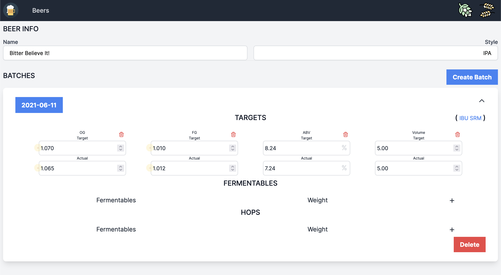

# What

The subprojects are as follows:

- [homebrew](./homebrew): A rust crate containing homebrewing-related algorithms and constants
  required to make various computations useful in homebrewing.

- [homebrew-web](./homebrew-web): A rust web API which helps an individual manage their
  beers/batches, generally saving info and performing calculations.

- [homebrew-ui](./homebrew-ui): A Vue SPA acting as a front-end to the API.

  

# Why

Generally homebrew-web/ui are meant to approximate something like [Brewfather](brewfather.app/),
[Brewer's Friend](https://www.brewersfriend.com/) or their like.

The primary reason for this being started (beyond being an interesting project) are thus:

- The alternatives all cost a monthly fee for things I want. The main idea is that one should be
  able to run this themselves. I personally will be running this on a NAS locally.
- Features which I cannot get elsewhere: There **will** be a means of recording and graphing things
  like temperature/gravity over time, something which I previously would have done in excel.
- Consistency of computation: Before I might have recorded things in Brewfather, then duplicated the
  measurements into my Excel sheet only to see the expected ABV being different, or what have you.
  The specific algorithm is obviously in the homebrew crate, and translates directly to where things
  like the graphed measurements will show their values.
- Workflow differences: Obviously I can control everything about how the app works and the workflow
  of how information is input. I consider Brewfather the most pleasant to use otherwise. But I still
  find inputting information into it to clash with how I record data normally.

# Development

## General

### Setup

Eventually the idea is that you should be able to `docker compose up` the project directly. However
today you'll need to go into the ui/web folders and stand them up individually.

### Linting/Fixing

``` bash
make lint
```

### Build

``` bash
make build
```

## Client

#### Compiles and hot-reloads for development

``` bash
cd homebrew-ui
make run
```

#### Customize configuration

See [Configuration Reference](https://cli.vuejs.org/config/).

## Server

#### Compiles and hot-reloads for development

``` bash
cd homebrew-web
make run
```
